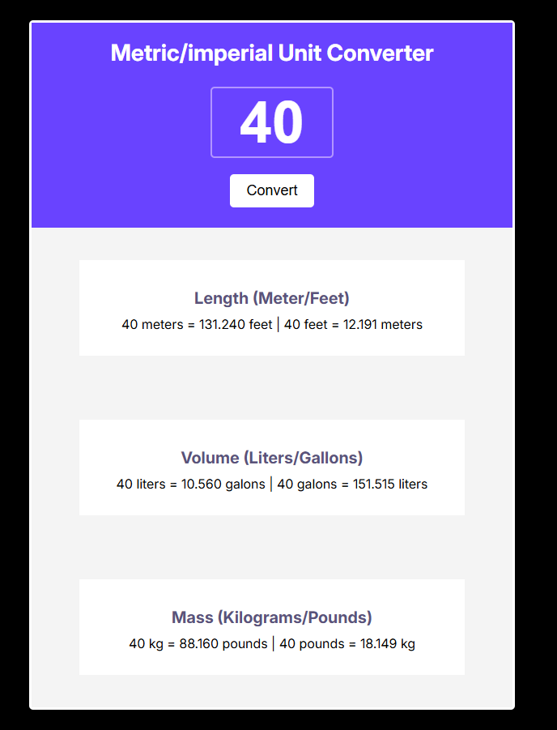

# Unit Converter Scrimba 
This is my attempt at the unit converter scrimba solo project as part of the scrimba full stack developer course, please see [Become a full stack developer](https://www.youtube.com/watch?v=LzMnsfqjzkA)

## Project Preview 
Here is a preview image of the site:

 [view the site live!](https://mrjgee.github.io/Unit-Converter-Scrimba-Solo-Project/)

## My Process

### Languages and tools
* HTML
* CSS
* Javascript
* VScode

### Built with
* Desktop first workflow
* Custom CSS properties 
* CSS Flexbox
* Vanilla Javascript 

### Resources
* [Free online course](https://www.youtube.com/watch?v=LzMnsfqjzkA)
* [Figma file](https://www.figma.com/design/K5GglbT6QqmLM3yvBXFdop/Unit-Conversion--Copy-?node-id=0-1&p=f&t=XkCm7HGvJTxNPpnq-0)